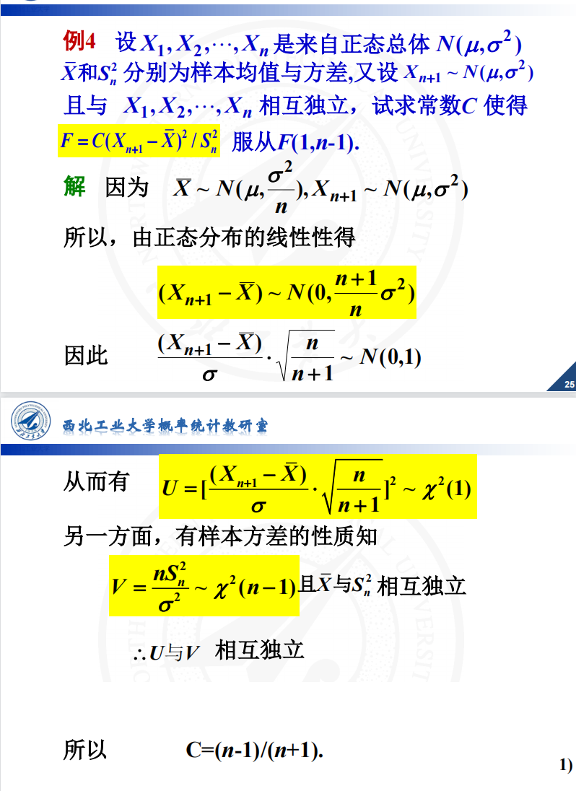

#### 二. 什么是GitHub？

GitHub为开发者提供Git仓库的托管服务(主要服务是将你的项目代码托管到云服务器上，而非存储在自己本地硬盘上。)，是一个让大家共享代码的完美场所；GitHub还为开发者或团队提供了一系列功能，帮助其高效率、高品质地进行代码编写。而GitHub是一个代码托管网站，背后使用Git作为版本管理工具（而非svn）。

**1.GitHub一些功能概述**

1. Pull Request功能
   Pull Request功能使素未谋面的开发者们隔着半个地球的距离共同开发软件，开发者在本地对源代码进行更改后，向GitHub中托管的Git仓库请求合并。开发者可以在Pull Request上通过评论交流，例如：修正了BUG，可以合并一下吗？如图：
   
   GitHub的Pull Request不但能轻松查看源代码的前后差别，还可以对指定的一行代码进行评论，如下图：
   
2. 对特定用户进行评论（Issue功能）
   任务管理和BUG报告可以通过Issue进行交互。如果想让特定用户来看，只要用“@用户名”的格式书写，对方便会接到通知（Notifications）查看Issue；
   
3. GFM语法
   在GitHub上，用户所有用文字输入的功能都可以用GitHub Flavored Markdown（GFM）语法进行描述。这个语法可以让标记变得简单，随着GitHub的普及，正在有越来越多的服务开始兼容Markdown语法。
4. 看到其他团队的软件（Watch功能）
   只要将感兴趣的仓库添加至Watch中，就可以在News Feed查看该仓库的相关信息，如图：
   
   比如，将全公司共用代码库的仓库添加到Watch中，便能在第一时间掌握最新版本的新功能或BUG修正的信息。当然，也可以通过Pull Request提交代码。就相当于关注了这个仓库，第一时间能收到他的最新更新消息。
5. 与开源软件相同的开发模式
   将GitHub运用到企业中，便会带来与开源软件开发相同的开发模式。已经熟悉开源软件开发的开发者不必专门去学习企业独自采用的工具，就可以直接加入到开发行列。

**2. 社会化编程**

GitHub的出现为软件开发者的世界带来了真正意义上的“民主”，让所有人都平等地拥有了更改源代码的权利。这在软件开发领域是一场巨大的革命。而革命领导者GitHub的口号便是“社会化编程”。

**3. GitHub提供的主要功能**

1. Git仓库
   一般情况下，我们可以免费建立任意个GitHub提供的Git仓库。但如果需要建立只对特定人物或只对自己公开的私有仓库，则需要依照套餐类型支付每月最低7美元的使用费。
2. Organization
   通常来说，个人使用时只要使用个人账户就足够了，但如果是公司，建议使用Organization账户。它的优点在于可以统一管理账户和权限，还能统一支付一些费用。
3. Issue
   Issue功能，是将一个任务或问题分配给一个Issue进行追踪和管理的功能。在GitHub上，每当进行Pull Request，都会同时创建一个Issue。
   每一个功能更改或修正都对应一个Issue，讨论或修正都以这个Issue为中心进行。只要查看Issue，就能知道和这个更改相关的一切信息，并以此进行管理。
4. Wiki
   通过Wiki功能，任何人都能随时对一篇文章进行更改并保存，因此可以多人共同完成一篇文章。该功能常用在开发文档或手册的编写中。语法方面，可以通GFM语法进行书写。
   Wiki页也是作为Git仓库进行管理的，改版的历史记录会被切实保存下来，使用者可以放心改写。由于其支持克隆至本地进行编辑，所以程序员使用时可以不必开启浏览器。
5. Pull Request
   开发者向GitHub的仓库推送更改或功能添加后，可以通过Pull Request功能向别人的仓库提出申请，请求对方合并。
   Pull Request送出后，目标仓库的管理者等人将能够查看Pull Request的内容及其中包含的代码更改。

**4. 说明**

本文为《GitHub入门与实践》读书笔记，如有错误，还请兄弟们指正，大家一起进步。

